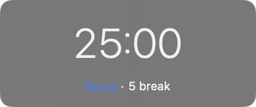
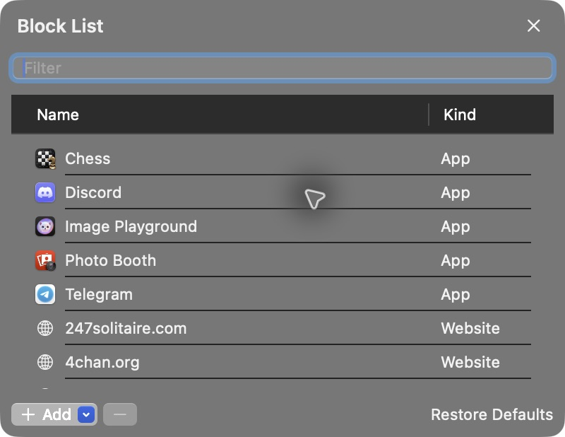

# Pomodoro Blocker

A tiny macOS menu bar timer that blocks distracting apps and websites while you focus.

 

## Install

Requires macOS 14+ and [Homebrew](https://brew.sh).

```sh
brew install --cask marcusmalloc/tap/pomodoro-blocker
```

Open **PomodoroBlocker** from Applications. The app isn't notarized; approve its first launch in **System Settings → Privacy & Security → Open Anyway**.

## Use

- Click the clock to start or pause.
- Double-click the stopped clock to edit minutes. Your settings are saved.
- Click the small **break** or **focus** caption to switch timers.
- Hold **⌥** and click the clock to reset.
- Right-click the menu bar icon for **Block List**, **Launch at Login**, and **Quit**.

Return or Space starts and pauses. ↑/↓ or scrolling adjusts minutes. Website blocking asks for an administrator password once per launch; pausing, taking a break, or quitting removes the block.



[Build and release](docs/development.md) · [Third-party credits](THIRD_PARTY_NOTICES.md)
